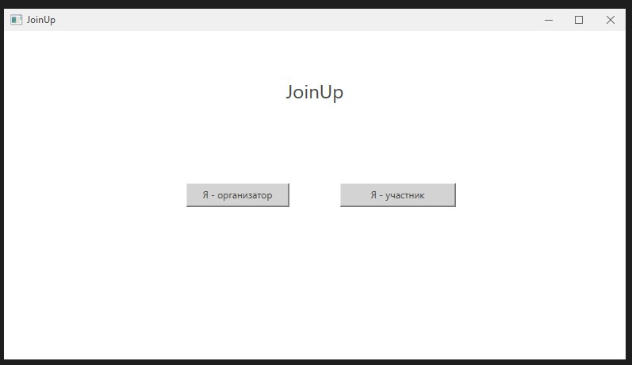


# Разработка интерфейса

## 1. Общие принципы
- Интерфейс должен быть интуитивно понятным и удобным для всех ролей пользователей.
- Все основные функции доступны за несколько кликов.
- Используются стандартные WPF-элементы управления: **DataGrid**, **Button**, **TextBox**, встроенное контекстное окно календаря.
- Навигация между окнами осуществляется через кнопки и события.

---

## 2. Окно выбора роли
**Элементы интерфейса:**
- Кнопка «Я организатор»
- Кнопка «Я участник»

**Функционал:**
- По нажатию на одну из кнопок происходит переход к окну регистрации и авторизации, где выбранная роль уже предустановлена.

---

## 3. Окно регистрации и авторизации (объединённое)
**Элементы интерфейса:**
- Отображение выбранной роли (организатор или участник)
- Поле ввода логина (TextBox)
- Поле ввода пароля (PasswordBox)
- Кнопка «Регистрация»
- Кнопка «Войти»

**Функционал:**
- Регистрация нового пользователя с выбранной ролью.
- Аутентификация по имени и паролю.
- Перенаправление пользователя в интерфейс, соответствующий его роли.

---

## 4. Роль: Участник

### Главный экран
**Элементы интерфейса:**
- Список доступных секций / мероприятий (DataGrid)
- Кнопка «Присоединиться к секции»
- Кнопка «Назад»

**Функционал:**
- Просмотр доступных секций.
- Возможность присоединиться к выбранной секции.

---

## 5. Роль: Организатор

### Главный экран
**Элементы интерфейса:**
- Список мероприятий (DataGrid)
- Кнопка «Создать мероприятие»
- Встроенное контекстное окно календаря для выбора даты события
- Кнопка «Просмотреть заявки на участие»
- Кнопка «Отметить явку»

**Функционал:**
- Создание и управление мероприятиями.
- Просмотр заявок участников.
- Учёт посещаемости.

---

## 6. Навигация
- Переходы между окнами реализованы через кнопки.
- Пример:  
  - Нажатие «Создать мероприятие» открывает окно создания мероприятия.  
  - Нажатие «Просмотреть заявки» — окно заявок на участие.

---

## 7. Потенциальные улучшения интерфейса
- Реализация адаптивного дизайна.
- Добавление тёмной темы.
- Более интуитивный дизайн.

---

## 8. Заключение
Интерфейс JoinUp ориентирован на простоту и удобство для пользователей с разными ролями. Минимум действий и стандартные элементы управления обеспечивают быстрый доступ к нужным функциям.

